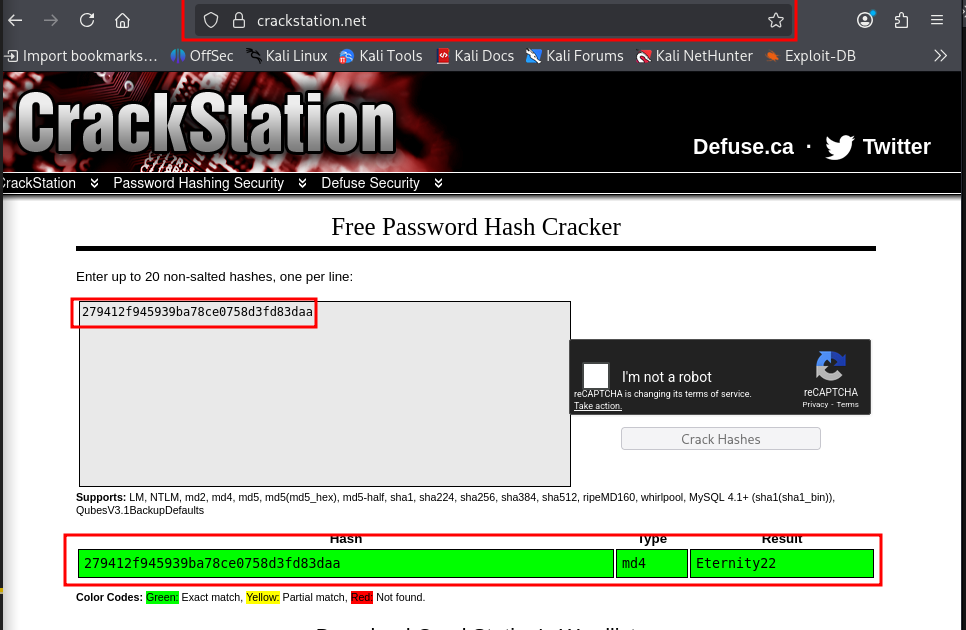

# Crack the hash


## Description

Cracking hashes challenges

## Prérequis

### Outils utilisés

#### `haiti-hash`

pour identifier les hashes

#### `johntheripper` et `hashcat`

 pour effectuer les hashes

#### wordlist `rockyou.txt`

célèbre wordlist

### Installation

#### `johntheripper` et `hashcat` procédure d'installation

sont installés par défaut sur kali-linux

#### `haiti-hash` procédure d'installation

`sudo gem install haiti-hash`

```bash
[sudo] Mot de passe de $USER : 
Fetching haiti-hash-4.0.0.gem
Fetching paint-2.3.0.gem
Fetching docopt-0.6.1.gem
Successfully installed paint-2.3.0
Successfully installed docopt-0.6.1
Successfully installed haiti-hash-4.0.0
Parsing documentation for paint-2.3.0
Installing ri documentation for paint-2.3.0
Parsing documentation for docopt-0.6.1
Installing ri documentation for docopt-0.6.1
Parsing documentation for haiti-hash-4.0.0
Installing ri documentation for haiti-hash-4.0.0
Done installing documentation for paint, docopt, haiti-hash after 0 seconds
3 gems installed
```

#### wordlist `rockyou.txt` procédure d'installation

dans kali-linux,cette wordlist est compressé au format gz donc on l'extrait de l'archive avec la commande suivante:

`sudo gzip -d /usr/share/wordlists/rockyou.txt.gz`

## Tasks

### Task 1

#### Identification du hash 1

- commande:
`cat hash1.txt | haiti -`

- résultat:

```bash
MD5 [HC: 0] [JtR: raw-md5]
LM [HC: 3000] [JtR: lm]
NTLM [HC: 1000] [JtR: nt]
Domain Cached Credentials (DCC), MS Cache [HC: 1100] [JtR: mscash]
Domain Cached Credentials 2 (DCC2), MS Cache 2 [HC: 2100] [JtR: mscash2]
IPB 2.x (Invision Power Board) [HC: 2811]
WPA-EAPOL-PMK [HC: 2501]
WPA-EAPOL-PBKDF2 [HC: 2500]
Bitcoin WIF private key (P2PKH), uncompressed [HC: 28502]
Bitcoin WIF private key (P2PKH), compressed [HC: 28501]
Umbraco HMAC-SHA1 [HC: 24800]
RAdmin v2.x [HC: 9900] [JtR: radmin]
DNSSEC (NSEC3) [HC: 8300]
IPMI 2.0 RAKP HMAC-MD5 [HC: 7350]
Snefru-128 [JtR: snefru-128]
RIPEMD-128 [JtR: ripemd-128]
Keyed MD5: RIPv2, OSPF, BGP, SNMPv2 [JtR: net-md5]
Skype [HC: 23]
Lotus Notes/Domino 5 [HC: 8600] [JtR: lotus5]
Haval-128 (4 rounds) [JtR: haval-128-4]
MD4 [HC: 900] [JtR: raw-md4]
MD2 [JtR: md2]
```

- Le hash est probablement au format `MD5`

#### crackage du hash

- commande:

`john --format=raw-md5 --wordlist=/usr/share/wordlists/rockyou.txt hash1.txt`

- resultat:

```bash
Created directory: /home/hachim/.john
Using default input encoding: UTF-8
Loaded 1 password hash (Raw-MD5 [MD5 256/256 AVX2 8x3])
Warning: no OpenMP support for this hash type, consider --fork=4
Press 'q' or Ctrl-C to abort, almost any other key for status
easy             (?)     
1g 0:00:00:00 DONE (2026-01-18 01:35) 33.33g/s 5747Kp/s 5747Kc/s 5747KC/s florida69..eagames
Use the "--show --format=Raw-MD5" options to display all of the cracked passwords reliably
Session completed.
```

- Mot de passe: `easy`

#### Identification du hash 2

```bash
cat hash2.txt | haiti - 

SHA-1 [HC: 100] [JtR: raw-sha1]
RIPEMD-160 [HC: 6000] [JtR: ripemd-160]
Double SHA-1 [HC: 4500]
Ruby on Rails Restful Auth (one round, no sitekey) [HC: 27200]
MySQL5.x [HC: 300] [JtR: mysql-sha1]
MySQL4.1 [HC: 300] [JtR: mysql-sha1]
Umbraco HMAC-SHA1 [HC: 24800]
WPA-EAPOL-PBKDF2 [HC: 2500]
WPA-EAPOL-PMK [HC: 2501]
Haval-160 (3 rounds) [JtR: dynamic_190]
Haval-160 (4 rounds) [JtR: dynamic_200]
Haval-160 (5 rounds) [JtR: dynamic_210]
HAS-160
LinkedIn [HC: 190] [JtR: raw-sha1-linkedin]
Skein-256(160)
Skein-512(160)
```

- Format: `SHA-1`

#### crackage du hash 2

```bash
john --format=raw-sha1 --wordlist=/usr/share/wordlists/rockyou.txt hash2.txt

Using default input encoding: UTF-8
Loaded 1 password hash (Raw-SHA1 [SHA1 256/256 AVX2 8x])
Warning: no OpenMP support for this hash type, consider --fork=4
Press 'q' or Ctrl-C to abort, almost any other key for status
password123      (?)     
1g 0:00:00:00 DONE (2026-01-18 01:41) 20.00g/s 27680p/s 27680c/s 27680C/s jesse..password123
Use the "--show --format=Raw-SHA1" options to display all of the cracked passwords reliably
Session completed.
```

- Mot de passe: `password123`

#### Identification du hash 3

```bash
cat hash3.txt | haiti -

SHA-256 [HC: 1400] [JtR: raw-sha256]
GOST R 34.11-94 [HC: 6900] [JtR: gost]
SHA3-256 [HC: 17400] [JtR: dynamic_380]
Keccak-256 [HC: 17800] [JtR: raw-keccak-256]
Snefru-256 [JtR: snefru-256]
PANAMA [JtR: dynamic_320]
BLAKE2-256 (blake2b)
BLAKE2-256 (blake2s)
MD6-256 [HC: 34600]
sm3
Shake-128 (256)
Shake-256 (256)
Shake-512 (256)
BLAKE3
Streebog-256
IPMI 2.0 RAKP HMAC-SHA1 [HC: 7300]
Umbraco HMAC-SHA1 [HC: 24800]
WPA-EAPOL-PBKDF2 [HC: 2500]
WPA-EAPOL-PMK [HC: 2501]
RIPEMD-256 [JtR: dynamic_140]
Haval-256 (3 rounds) [JtR: haval-256-3]
Haval-256 (4 rounds) [JtR: dynamic_290]
Haval-256 (5 rounds) [JtR: dynamic_300]
GOST CryptoPro S-Box
Skein-256 [JtR: skein-256]

```

- Format: `SHA-256`

#### Crackage du hash 3

```bash
john --format=raw-sha256 --wordlist=/usr/share/wordlists/rockyou.txt hash3.txt

Using default input encoding: UTF-8
Loaded 1 password hash (Raw-SHA256 [SHA256 256/256 AVX2 8x])
Warning: poor OpenMP scalability for this hash type, consider --fork=4
Will run 4 OpenMP threads
Press 'q' or Ctrl-C to abort, almost any other key for status
letmein          (?)     
1g 0:00:00:00 DONE (2026-01-18 01:51) 50.00g/s 3276Kp/s 3276Kc/s 3276KC/s 123456..sabrina7
Use the "--show --format=Raw-SHA256" options to display all of the cracked passwords reliably
Session completed. 
```

- Mot de passe: `letmein`

#### Identification du hash 4

```bash
cat hash4.txt | haiti -

bcrypt [HC: 3200] [JtR: bcrypt]
Blowfish(OpenBSD) [HC: 3200] [JtR: bcrypt]
Woltlab Burning Board 4.x
bcrypt(sha256($pass)) / bcryptsha256 [HC: 30600]

```

- Format: `bcrypt`

#### Crackage du hash 4

- pour ce ces on doit d'abord filtrer la wordlist `rockyou.txt` en ne gardant que les mots de 4 caractères ou le programme va être très long.Pou ce faire,une méthode que j'ai utilisé est de construire une nouvelle wordlist nommée `rockyou_4chars.txt` avec la commande suivante:

`grep -x '.\{4\}' /usr/share/wordlists/rockyou.txt > rockyou_4chars.txt`

puis,on exécute la commande suivante

```bash
john --format=bcrypt --wordlist=rockyou_4chars.txt hash4.txt

Using default input encoding: UTF-8
Loaded 1 password hash (bcrypt [Blowfish 32/64 X3])
Cost 1 (iteration count) is 4096 for all loaded hashes
Will run 4 OpenMP threads
Press 'q' or Ctrl-C to abort, almost any other key for status
0g 0:00:00:08 2.77% (ETA: 02:18:06) 0g/s 56.25p/s 56.25c/s 56.25C/s 1229..todd
bleh             (?)     
1g 0:00:00:12 DONE (2026-01-18 02:13) 0.08257g/s 56.48p/s 56.48c/s 56.48C/s bleh..mets
Use the "--show" option to display all of the cracked passwords reliably
Session completed.
```

- Mot de passe: `bleh`

#### Identification et crackage du hash 5

sur le site [crackstation](https://crackstation.net/), on insère le hash dans le champ dde texte et il identifie le type de hash ainsi wue le mot de passe



- Format: `MD4`

- Mot de passe: `Eternity22`

### Task 2

#### Identification du hash 6

```bash
cat hash6.txt | haiti -

SHA-256 [HC: 1400] [JtR: raw-sha256]
GOST R 34.11-94 [HC: 6900] [JtR: gost]
SHA3-256 [HC: 17400] [JtR: dynamic_380]
Keccak-256 [HC: 17800] [JtR: raw-keccak-256]
Snefru-256 [JtR: snefru-256]
PANAMA [JtR: dynamic_320]
BLAKE2-256 (blake2b)
BLAKE2-256 (blake2s)
MD6-256 [HC: 34600]
sm3
Shake-128 (256)
Shake-256 (256)
Shake-512 (256)
BLAKE3
Streebog-256
IPMI 2.0 RAKP HMAC-SHA1 [HC: 7300]
Umbraco HMAC-SHA1 [HC: 24800]
WPA-EAPOL-PBKDF2 [HC: 2500]
WPA-EAPOL-PMK [HC: 2501]
RIPEMD-256 [JtR: dynamic_140]
Haval-256 (3 rounds) [JtR: haval-256-3]
Haval-256 (4 rounds) [JtR: dynamic_290]
Haval-256 (5 rounds) [JtR: dynamic_300]
GOST CryptoPro S-Box
Skein-256 [JtR: skein-256]

```

- Format: `SHA-256`

#### Crackage du hash 6

```bash
hashcat -a 0 -m 1400 hash6.txt /usr/share/wordlists/rockyou.txt 

hashcat (v7.1.2) starting

OpenCL API (OpenCL 3.0 PoCL 6.0+debian  Linux, None+Asserts, RELOC, SPIR-V, LLVM 18.1.8, SLEEF, DISTRO, POCL_DEBUG) - Platform #1 [The pocl project]
====================================================================================================================================================
* Device #01: cpu-haswell-AMD Ryzen 7 6800H with Radeon Graphics, 1469/2939 MB (512 MB allocatable), 4MCU

Minimum password length supported by kernel: 0
Maximum password length supported by kernel: 256

Hashes: 1 digests; 1 unique digests, 1 unique salts
Bitmaps: 16 bits, 65536 entries, 0x0000ffff mask, 262144 bytes, 5/13 rotates
Rules: 1

Optimizers applied:
* Zero-Byte
* Early-Skip
* Not-Salted
* Not-Iterated
* Single-Hash
* Single-Salt
* Raw-Hash

ATTENTION! Pure (unoptimized) backend kernels selected.
Pure kernels can crack longer passwords, but drastically reduce performance.
If you want to switch to optimized kernels, append -O to your commandline.
See the above message to find out about the exact limits.

Watchdog: Hardware monitoring interface not found on your system.
Watchdog: Temperature abort trigger disabled.

Host memory allocated for this attack: 513 MB (1383 MB free)

Dictionary cache building /usr/share/wordlists/rockyou.txt: 33553434 bytes (2Dictionary cache built:
* Filename..: /usr/share/wordlists/rockyou.txt
* Passwords.: 14344392
* Bytes.....: 139921507
* Keyspace..: 14344385
* Runtime...: 1 sec

f09edcb1fcefc6dfb23dc3505a882655ff77375ed8aa2d1c13f640fccc2d0c85:paule
                                                          
Session..........: hashcat
Status...........: Cracked
Hash.Mode........: 1400 (SHA2-256)
Hash.Target......: f09edcb1fcefc6dfb23dc3505a882655ff77375ed8aa2d1c13f...2d0c85
Time.Started.....: Sun Jan 18 21:58:45 2026 (0 secs)
Time.Estimated...: Sun Jan 18 21:58:45 2026 (0 secs)
Kernel.Feature...: Pure Kernel (password length 0-256 bytes)
Guess.Base.......: File (/usr/share/wordlists/rockyou.txt)
Guess.Queue......: 1/1 (100.00%)
Speed.#01........:  1439.6 kH/s (0.37ms) @ Accel:1024 Loops:1 Thr:1 Vec:8
Recovered........: 1/1 (100.00%) Digests (total), 1/1 (100.00%) Digests (new)
Progress.........: 81920/14344385 (0.57%)
Rejected.........: 0/81920 (0.00%)
Restore.Point....: 77824/14344385 (0.54%)
Restore.Sub.#01..: Salt:0 Amplifier:0-1 Iteration:0-1
Candidate.Engine.: Device Generator
Candidates.#01...: superm -> janson

Started: Sun Jan 18 21:58:24 2026
Stopped: Sun Jan 18 21:58:46 2026

```

- Mot de passe: `paule`

#### Identification du hash 7

```bash
cat hash7.txt | haiti -        

MD5 [HC: 0] [JtR: raw-md5]
LM [HC: 3000] [JtR: lm]
NTLM [HC: 1000] [JtR: nt]
Domain Cached Credentials (DCC), MS Cache [HC: 1100] [JtR: mscash]
Domain Cached Credentials 2 (DCC2), MS Cache 2 [HC: 2100] [JtR: mscash2]
IPB 2.x (Invision Power Board) [HC: 2811]
WPA-EAPOL-PMK [HC: 2501]
WPA-EAPOL-PBKDF2 [HC: 2500]
Bitcoin WIF private key (P2PKH), uncompressed [HC: 28502]
Bitcoin WIF private key (P2PKH), compressed [HC: 28501]
Umbraco HMAC-SHA1 [HC: 24800]
RAdmin v2.x [HC: 9900] [JtR: radmin]
DNSSEC (NSEC3) [HC: 8300]
IPMI 2.0 RAKP HMAC-MD5 [HC: 7350]
Snefru-128 [JtR: snefru-128]
RIPEMD-128 [JtR: ripemd-128]
Keyed MD5: RIPv2, OSPF, BGP, SNMPv2 [JtR: net-md5]
Skype [HC: 23]
Lotus Notes/Domino 5 [HC: 8600] [JtR: lotus5]
Haval-128 (4 rounds) [JtR: haval-128-4]
MD4 [HC: 900] [JtR: raw-md4]
MD2 [JtR: md2]

```

- Format: `NTLM`

#### Crackage du hash 7

```bash
hashcat -a 0 -m 1000 hash7.txt /usr/share/wordlists/rockyou.txt

hashcat (v7.1.2) starting

OpenCL API (OpenCL 3.0 PoCL 6.0+debian  Linux, None+Asserts, RELOC, SPIR-V, LLVM 18.1.8, SLEEF, DISTRO, POCL_DEBUG) - Platform #1 [The pocl project]
====================================================================================================================================================
* Device #01: cpu-haswell-AMD Ryzen 7 6800H with Radeon Graphics, 1469/2939 MB (512 MB allocatable), 4MCU

Minimum password length supported by kernel: 0
Maximum password length supported by kernel: 256

Hashes: 1 digests; 1 unique digests, 1 unique salts
Bitmaps: 16 bits, 65536 entries, 0x0000ffff mask, 262144 bytes, 5/13 rotates
Rules: 1

Optimizers applied:
* Zero-Byte
* Early-Skip
* Not-Salted
* Not-Iterated
* Single-Hash
* Single-Salt
* Raw-Hash

ATTENTION! Pure (unoptimized) backend kernels selected.
Pure kernels can crack longer passwords, but drastically reduce performance.
If you want to switch to optimized kernels, append -O to your commandline.
See the above message to find out about the exact limits.

Watchdog: Hardware monitoring interface not found on your system.
Watchdog: Temperature abort trigger disabled.

Host memory allocated for this attack: 513 MB (1208 MB free)

Dictionary cache hit:
* Filename..: /usr/share/wordlists/rockyou.txt
* Passwords.: 14344385
* Bytes.....: 139921507
* Keyspace..: 14344385

1dfeca0c002ae40b8619ecf94819cc1b:n63umy8lkf4i             
                                                          
Session..........: hashcat
Status...........: Cracked
Hash.Mode........: 1000 (NTLM)
Hash.Target......: 1dfeca0c002ae40b8619ecf94819cc1b
Time.Started.....: Sun Jan 18 22:05:02 2026 (0 secs)
Time.Estimated...: Sun Jan 18 22:05:02 2026 (0 secs)
Kernel.Feature...: Pure Kernel (password length 0-256 bytes)
Guess.Base.......: File (/usr/share/wordlists/rockyou.txt)
Guess.Queue......: 1/1 (100.00%)
Speed.#01........:  8135.4 kH/s (0.12ms) @ Accel:1024 Loops:1 Thr:1 Vec:8
Recovered........: 1/1 (100.00%) Digests (total), 1/1 (100.00%) Digests (new)
Progress.........: 5242880/14344385 (36.55%)
Rejected.........: 0/5242880 (0.00%)
Restore.Point....: 5238784/14344385 (36.52%)
Restore.Sub.#01..: Salt:0 Amplifier:0-1 Iteration:0-1
Candidate.Engine.: Device Generator
Candidates.#01...: n6ri2fdkgm9y -> n1ckow3n

Started: Sun Jan 18 22:04:50 2026
Stopped: Sun Jan 18 22:05:03 2026

```

- Mot de passe: `n63umy8lkf4i`

#### Identification du hash 8

```bash
cat hash8.txt | haiti -

SHA-512 Crypt [HC: 1800] [JtR: sha512crypt]
```

- Format: `SHA-512 Crypt`

#### crackage du hash 8

```bash
hashcat -a 0 -m 1800 hash8.txt /usr/share/wordlists/rockyou.txt -O

hashcat (v7.1.2) starting

OpenCL API (OpenCL 3.0 PoCL 6.0+debian  Linux, None+Asserts, RELOC, SPIR-V, LLVM 18.1.8, SLEEF, DISTRO, POCL_DEBUG) - Platform #1 [The pocl project]
====================================================================================================================================================
* Device #01: cpu-haswell-AMD Ryzen 7 6800H with Radeon Graphics, 1469/2939 MB (512 MB allocatable), 4MCU

Minimum password length supported by kernel: 0
Maximum password length supported by kernel: 15
Minimum salt length supported by kernel: 0
Maximum salt length supported by kernel: 51

Hashes: 1 digests; 1 unique digests, 1 unique salts
Bitmaps: 16 bits, 65536 entries, 0x0000ffff mask, 262144 bytes, 5/13 rotates
Rules: 1

Optimizers applied:
* Optimized-Kernel
* Zero-Byte
* Single-Hash
* Single-Salt
* Uses-64-Bit
* Register-Limit

Watchdog: Hardware monitoring interface not found on your system.
Watchdog: Temperature abort trigger disabled.

Host memory allocated for this attack: 513 MB (1029 MB free)

Dictionary cache hit:
* Filename..: /usr/share/wordlists/rockyou.txt
* Passwords.: 14344385
* Bytes.....: 139921507
* Keyspace..: 14344385

...SNIP...

[s]tatus [p]ause [b]ypass [c]heckpoint [f]inish [q]uit => s

Session..........: hashcat
Status...........: Running
Hash.Mode........: 1800 (sha512crypt $6$, SHA512 (Unix))
Hash.Target......: $6$aReallyHardSalt$6WKUTqzq.UQQmrm0p/T7MPpMbGNnzXPM...ZAs02.
Time.Started.....: Sun Jan 18 22:27:09 2026 (11 mins, 58 secs)
Time.Estimated...: Sun Jan 18 23:48:55 2026 (1 hour, 9 mins)
Kernel.Feature...: Optimized Kernel (password length 0-15 bytes)
Guess.Base.......: File (/usr/share/wordlists/rockyou.txt)
Guess.Queue......: 1/1 (100.00%)
Speed.#01........:     2913 H/s (13.02ms) @ Accel:50 Loops:1000 Thr:1 Vec:4
Recovered........: 0/1 (0.00%) Digests (total), 0/1 (0.00%) Digests (new)
Progress.........: 2140497/14344385 (14.92%)
Rejected.........: 8097/2140497 (0.38%)
Restore.Point....: 2140497/14344385 (14.92%)
Restore.Sub.#01..: Salt:0 Amplifier:0-1 Iteration:3000-4000
Candidate.Engine.: Device Generator
Candidates.#01...: Fernlea -> Fans0fheart

$6$aReallyHardSalt$6WKUTqzq.UQQmrm0p/T7MPpMbGNnzXPMAXi4bJMl9be.cfi3/qxIf.hsGpS41BqMhSrHVXgMpdjS6xeKZAs02.:waka99
                                                          
Session..........: hashcat
Status...........: Cracked
Hash.Mode........: 1800 (sha512crypt $6$, SHA512 (Unix))
Hash.Target......: $6$aReallyHardSalt$6WKUTqzq.UQQmrm0p/T7MPpMbGNnzXPM...ZAs02.
Time.Started.....: Sun Jan 18 22:27:09 2026 (15 mins, 43 secs)
Time.Estimated...: Sun Jan 18 22:42:52 2026 (0 secs)
Kernel.Feature...: Optimized Kernel (password length 0-15 bytes)
Guess.Base.......: File (/usr/share/wordlists/rockyou.txt)
Guess.Queue......: 1/1 (100.00%)
Speed.#01........:     3041 H/s (13.34ms) @ Accel:50 Loops:1000 Thr:1 Vec:4
Recovered........: 1/1 (100.00%) Digests (total), 1/1 (100.00%) Digests (new)
Progress.........: 2832100/14344385 (19.74%)
Rejected.........: 20900/2832100 (0.74%)
Restore.Point....: 2831896/14344385 (19.74%)
Restore.Sub.#01..: Salt:0 Amplifier:0-1 Iteration:4000-5000
Candidate.Engine.: Device Generator
Candidates.#01...: wakacha -> waja4422

Started: Sun Jan 18 22:26:50 2026
Stopped: Sun Jan 18 22:42:54 2026
```

- Mot de passe: `waka99`

#### Identification du hash 9

```bash
cat hash9.txt | haiti - 

SHA-1 [HC: 100] [JtR: raw-sha1]
RIPEMD-160 [HC: 6000] [JtR: ripemd-160]
Double SHA-1 [HC: 4500]
Ruby on Rails Restful Auth (one round, no sitekey) [HC: 27200]
SMF ≥ v1.1 [HC: 121]
Haval-160 (3 rounds) [JtR: dynamic_190]
Haval-160 (4 rounds) [JtR: dynamic_200]
Haval-160 (5 rounds) [JtR: dynamic_210]
HAS-160
LinkedIn [HC: 190] [JtR: raw-sha1-linkedin]
Skein-256(160)
Skein-512(160)

```

- Format: `HMAC-SHA1`

#### Crackage du hash 9

```bash
hashcat -a 0 -m 160 hash9.txt /usr/share/wordlists/rockyou.txt -O

hashcat (v7.1.2) starting

OpenCL API (OpenCL 3.0 PoCL 6.0+debian  Linux, None+Asserts, RELOC, SPIR-V, LLVM 18.1.8, SLEEF, DISTRO, POCL_DEBUG) - Platform #1 [The pocl project]
====================================================================================================================================================
* Device #01: cpu-haswell-AMD Ryzen 7 6800H with Radeon Graphics, 1469/2939 MB (512 MB allocatable), 4MCU

Minimum password length supported by kernel: 0
Maximum password length supported by kernel: 31
Minimum salt length supported by kernel: 0
Maximum salt length supported by kernel: 51

Hashes: 1 digests; 1 unique digests, 1 unique salts
Bitmaps: 16 bits, 65536 entries, 0x0000ffff mask, 262144 bytes, 5/13 rotates
Rules: 1

Optimizers applied:
* Optimized-Kernel
* Zero-Byte
* Not-Iterated
* Single-Hash
* Single-Salt

Watchdog: Hardware monitoring interface not found on your system.
Watchdog: Temperature abort trigger disabled.

Host memory allocated for this attack: 513 MB (976 MB free)

Dictionary cache hit:
* Filename..: /usr/share/wordlists/rockyou.txt
* Passwords.: 14344385
* Bytes.....: 139921507
* Keyspace..: 14344385

e5d8870e5bdd26602cab8dbe07a942c8669e56d6:tryhackme:481616481616
                                                          
Session..........: hashcat
Status...........: Cracked
Hash.Mode........: 160 (HMAC-SHA1 (key = $salt))
Hash.Target......: e5d8870e5bdd26602cab8dbe07a942c8669e56d6:tryhackme
Time.Started.....: Sun Jan 18 22:52:09 2026 (3 secs)
Time.Estimated...: Sun Jan 18 22:52:12 2026 (0 secs)
Kernel.Feature...: Optimized Kernel (password length 0-31 bytes)
Guess.Base.......: File (/usr/share/wordlists/rockyou.txt)
Guess.Queue......: 1/1 (100.00%)
Speed.#01........:  4233.0 kH/s (0.58ms) @ Accel:1024 Loops:1 Thr:1 Vec:8
Recovered........: 1/1 (100.00%) Digests (total), 1/1 (100.00%) Digests (new)
Progress.........: 12315415/14344385 (85.86%)
Rejected.........: 2839/12315415 (0.02%)
Restore.Point....: 12311319/14344385 (85.83%)
Restore.Sub.#01..: Salt:0 Amplifier:0-1 Iteration:0-1
Candidate.Engine.: Device Generator
Candidates.#01...: 48211281 -> 4808328998

Started: Sun Jan 18 22:51:57 2026
Stopped: Sun Jan 18 22:52:12 2026

```

- Mot de passe: `481616481616`
